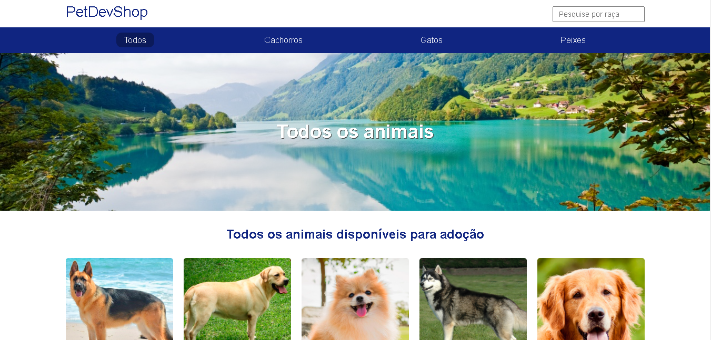
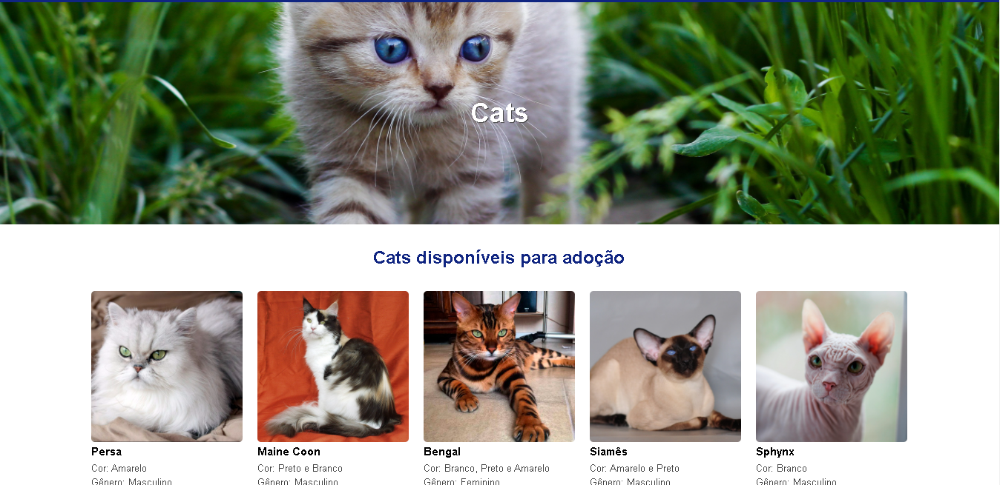
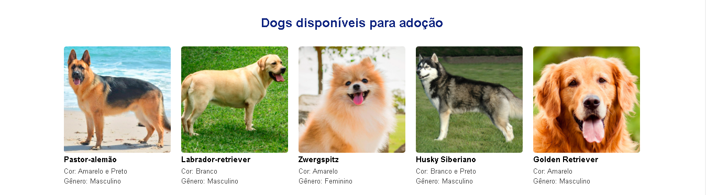

<h2>Mini sistema Petshop feito com express.js</h2>
 
 
  

## 💻 Projeto

 Projeto feito no módulo do curso "Nodejs" da b7web
 
 ## 🧱 Tecnologias

**Cliente:** [HTML](https://www.w3schools.com/html), [CSS](https://www.w3schools.com/css), [Mustache](https://github.com/janl/mustache.js)

**Servidor:** [Node](https://nodejs.org), [Express](https://expressjs.com), [TypeScript](https://www.typescriptlang.org)

**Controle de Versão:** [Git](https://git-scm.com/), [Gitflow](https://www.atlassian.com/br/git/tutorials/comparing-workflows/gitflow-workflow), [Gitmoji](https://gitmoji.dev/)

